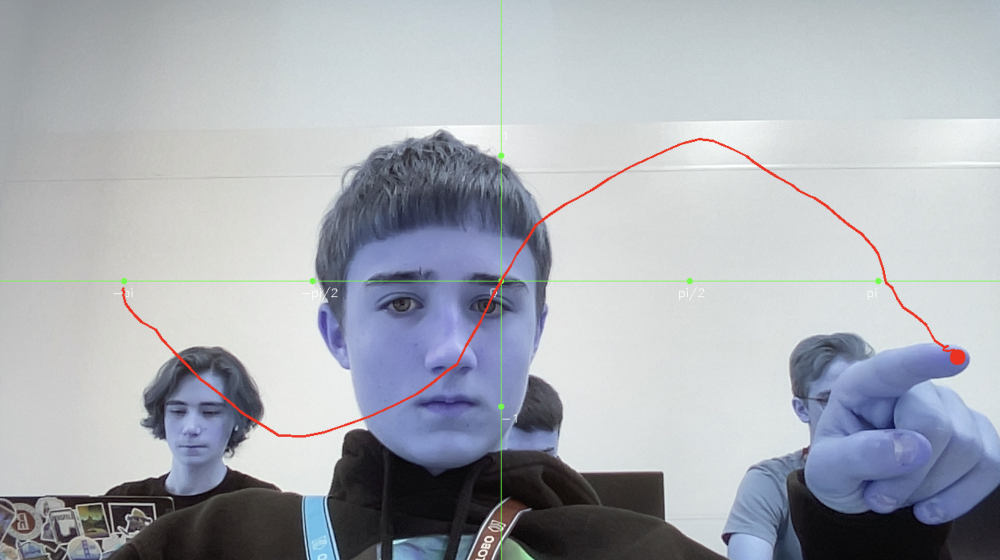

# Hand Tracking App

## Описание проекта
**Hand Tracking App** — это приложение, использующее компьютерное зрение для отслеживания движений рук в реальном времени. Программа позволяет визуализировать траекторию движения пальца, сравнивая ее с идеальной траекторией sin.

### Основные возможности:
- Определение ключевых точек кисти с использованием MediaPipe.
- Визуализация траектории движения пальца.
- Наложение графиков и координат на изображение. 
- Сравнение траектории движения пальца с идеальной траекторией sin

## Установка

1. Склонируйте репозиторий:
   ```bash
   git clone https://github.com/cortexgod/fingergraphics
   ```
2. Перейдите в каталог проекта:
   ```bash
   cd fingergraphics
   ```
3. Установите зависимости:
   ```bash
   pip install -r requirements.txt
   ```

## Использование

1. Подключите веб-камеру.
2. Убедитесь что комната достаточно освещена и камера не засвечена.
2. Запустите приложение:
   ```bash
   python main.py
   ```
3. Двигайте рукой перед камерой. Траектория движения пальца будет отображена на экране с наложенными координатными осями.

## Примеры работы



На изображении показана траектория движения пальца с наложением математической функции на график.

